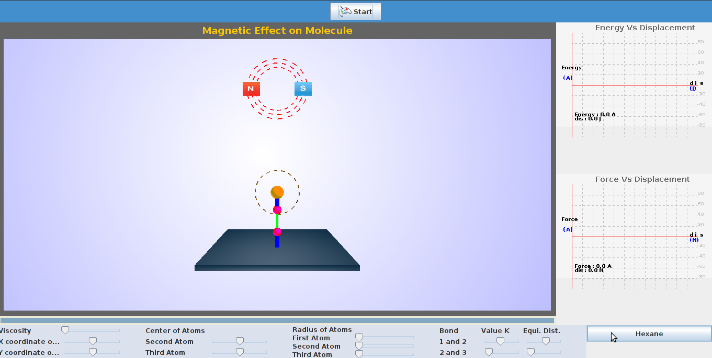
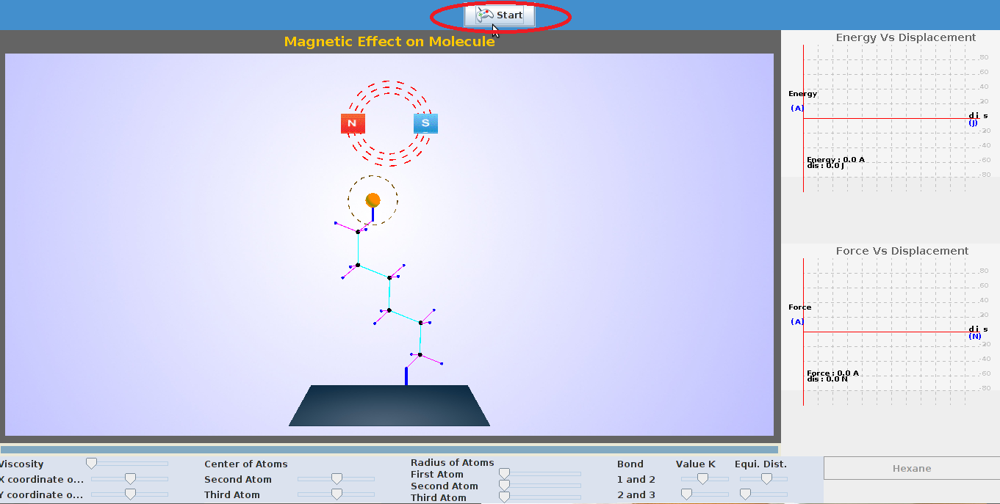
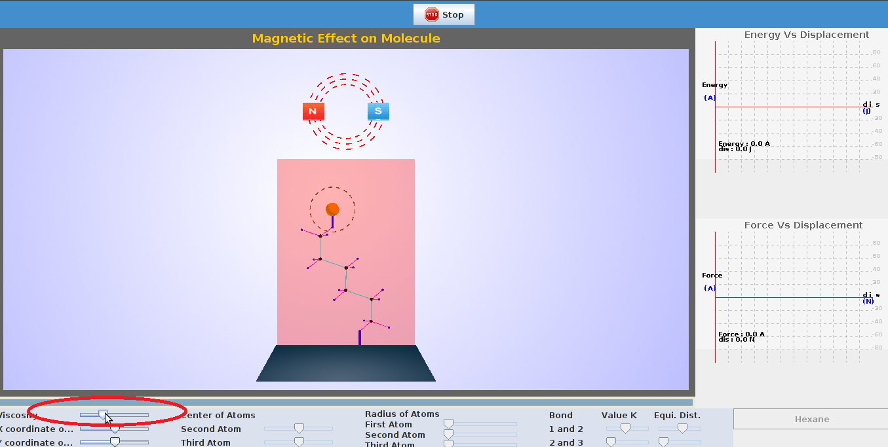

To perform this experiment there are certain parameters to be initialized and the procedure detailed here can be followed.  
Select the molecule on which experiment is to be performed.    

  

STEP 1:Click on the start button, to start the experiment.  

  

STEP 2:The viscosity of the medium can be varied with the help of slider as shown in the snapshot.  

  

STEP 3: The position of magnet can be varied by varying the coordinates of magnet provided as sliders.The change in energy by varying magnetic position is seen    
  